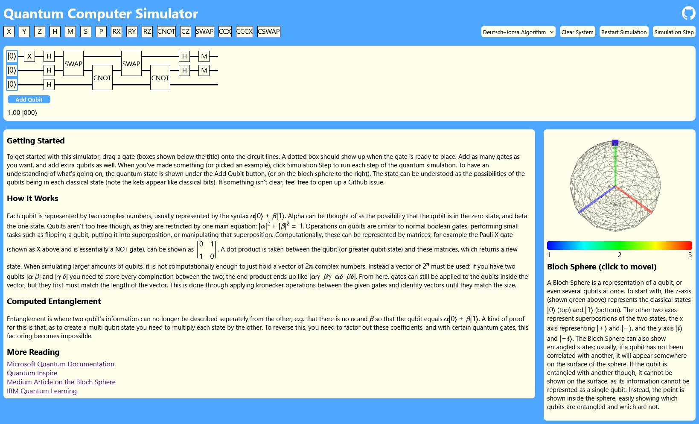

# Quantum Simulator

A [web editor](https://rhaskia.github.io/quantum) (built with dioxus) for quantum circuits, built on a library made from scratch in rust for quantum simulation. 
The web editor is fully featured, even containing a Bloch Sphere for easy visualization of quantum circuits. 
However, this is mostly meant as a teaching tool for basic quantum circuits, as it does not scale well. 
The quantum library can be used separately, but it was mostly built for this editor, so there are likely better options available.

# Features  
 - Qubit Operations
 - Multiple Qubit States
 - Simulation Stepping
 - Algorithm Examples
 - Bloch Sphere Visualization
 - Quantum State Output

# How to Use 
Drag the white boxes with words/letters at the top of the screen onto the black lines below. Once you've made something you want to test, hit the `Simulation Step` button.

# Running
Either use the github page for this repo or clone it and using the dioxus cli (```cargo install dioxus-cli``` - you will need rust installed as well) run the following: ```dx serve --package editor --platform web```
